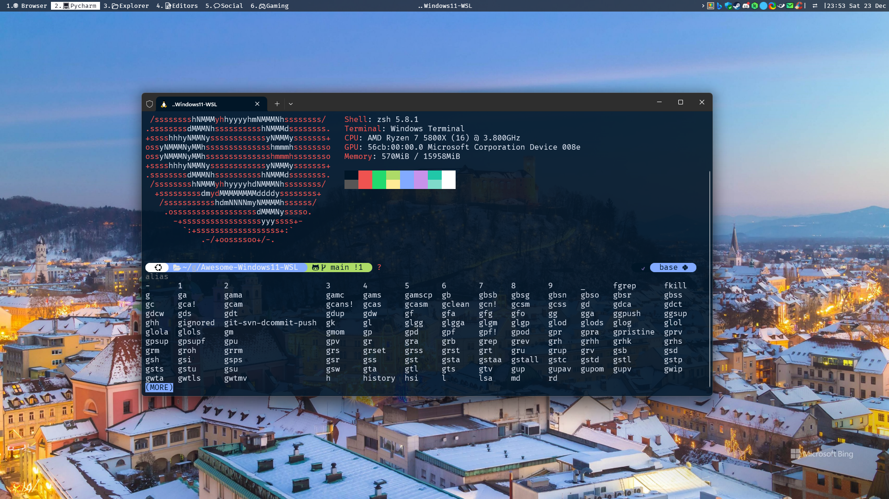

| Windows WSL Terminal                                          | Desktop with terminals                                             |
|---------------------------------------------------------------|--------------------------------------------------------------------|
|  |  |


<div style="text-align: center;">The image you are looking at is a screenshot of a WSL Ubuntu terminal in Windows 11. The top bar is an app called GlazeWM which is a a tiling WM that lets you organize windows and adjust their layout on the fly by using keyboard-driven commands.
You can follow this repository to get a similar setup on Windows11, Linux or both.


[](https://www.microsoft.com/en-in/windows)


</div>

**Table of contents**
<!-- TOC -->
  * [Linux/WSL2](#linuxwsl2)
  * [Windows 11/WSL2](#windows-11wsl2)
  * [Contributing](#contributing)
<!-- TOC -->

## Linux/WSL2
A set of configurations,
dotfiles and a script to automatically set up a powerful terminal & shell utilities(zsh, fzf...),
themes like Powerlvl10k, Conda, GPU drivers, and more on Linux/WSL2, again automatically.

Get started with one command (manual installation can be found in the docs below):
```bash
sh -c "$(wget https://raw.githubusercontent.com/AmineDjeghri/awesome-os-setup/main/docs/unix_workflow/setup_linux.sh -O -)"
```
- **My Linux/WSL2 docs**: Read more here: [README](docs/unix_workflow/README_unix.md) / [website](https://setup.aminedjeghri.com/readme-unix.html)

## Windows 11/WSL2
Valuable applications & tips for enhancing your Windows user experience, with a focus on creating a productive environment incorporating WSL 2 (Linux).

Get started with one command (powershell as administrator):

```powershell
iex ((New-Object System.Net.WebClient).DownloadString('https://raw.githubusercontent.com/AmineDjeghri/awesome-os-setup/main/docs/windows_workflow/setup_windows.ps1'))

```

- **My Windows/WSL2 docs**: Read more here: [windows_workflow_README.](docs/windows_workflow/README_windows.md) / [website](https://setup.aminedjeghri.com/readme-windows.html)

- **Browser extensions**:Read more here: [browser_extensions.md](docs/windows_workflow/browser_extensions.md) / [website](https://setup.aminedjeghri.com/browser-extensions.html)


### For Windows users: Why you should use WSL2?**

WSL2 enables users to run Linux applications and utilize command-line tools natively on their Windows machines.
This integration allows users
to enjoy the familiarity of Windows while simultaneously harnessing the power and flexibility of Linux.

|              | macOS                                                                         | Linux                                                                      | Windows with WSL                                                                                                                                                                                                                          |
|--------------|-------------------------------------------------------------------------------|----------------------------------------------------------------------------|-------------------------------------------------------------------------------------------------------------------------------------------------------------------------------------------------------------------------------------------|
| Advantages   | (+) Excellent for coding and video editing. Supports Adobe & Office products. | (+) Ideal for coding and gaming, providing good performance in both areas. | - (+) Seamless compatibility with diverse software, including Adobe & Office products. </br> (+) Optimal choice for gaming enthusiasts </br> (+) Well-suited for coding with Windows Subsystem for Linux (WSL) and no need for dual boot. |
| Inconvenient | (-) Limited gaming capabilities compared to Windows & Linux.                  | (-) Lacks support for Adobe & Office products and certain software.        | (-) UI is not smooth and responsive compared to macOS & Linux                                                                                                                                                                             |

Within the domain of development, Unix-based systems such as Linux and macOS frequently garner attention. Nevertheless, the integration of WSL allows smooth coding alongside the utilization of Adobe and Microsoft products that may lack support on Linux. This flexibility, coupled with the ability to handle resource-intensive games beyond macOS capabilities, positions Windows-WSL as an enticing platform, ensuring a well-rounded computing experience for all users, regardless of their workplace constraints.

Based on your needs, you can choose your OS.

## Contributing
A folder named `docs` contains the docs for generating the website with Jetbrains Writerside plugin.
Writerside supports only one file named `README.md`
that's why you will find other readme files like `unix_workflow/README_unix.md`
instead of being named `unix_workflow/README.md`.

You can also sync the repository's dotfiles with your local machine with `stow`:
```bash
stow -t ~ <folder_name>
```

**Star History Chart**
[](https://star-history.com/#aminedjeghri/awesomewindows11&Date)
